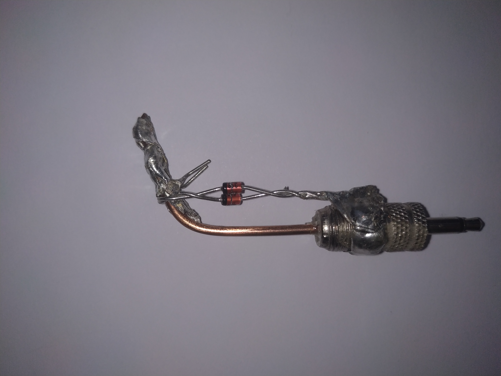

# ADC-Modus mit Diehard-Bitstream-Test
python3 onetimepad.py --source adc --seconds 120 --bits 3000000 --diehard

# GPIO-Modus mit Diehard-Bitstream-Test
python3 onetimepad.py --source gpio --bits 3000000 --diehard

# Nur Generierung, ohne Diehard-Test
python3 onetimepad.py --source adc --seconds 60 --bits 500000

# ADC,Jack,or GPIO Zener Diode:

